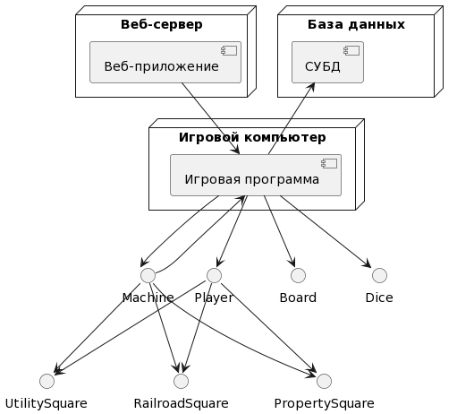

# **ОТЧЕТ ПО ПРАКТИЧЕСКОЙ РАБОТЕ №2**
## *по дисциплине «Технологии и методы программирования»*

Мы создали три узла: "Веб-сервер", "База данных" и "Игровой компьютер". На Веб-сервере развернуто приложение, которое взаимодействует с игрой Монополия на Игровом компьютере. Это сделано для возможности играть через веб-интерфейс. На узле База данных развернута СУБД для хранения данных игры.
Также мы добавили компоненты игры на диаграмму: игровая программа, игроки, кубики, доска и имущество (все, что необходимо для игры). Компоненты игры взаимодействуют между собой, а также с компонентами на других узлах. Эти компоненты игры развернуты на Игровом компьютере.

Рисунок 1 – диаграмма развертывания для игры Монополия

@startuml
node "Веб-сервер"
{
  component "Веб-приложение" as WebApp
}
node "База данных"
{
  component "СУБД" as DB
}
node "Игровой компьютер"
{
  component "Игровая программа" as Game
}
Machine --> Game
Game --> Board
Game --> Dice
Game --> Player
Game --> Machine
Player --> PropertySquare
Player --> UtilitySquare
Player --> RailroadSquare
Machine --> PropertySquare
Machine --> UtilitySquare
Machine --> RailroadSquare
DB <-- Game
WebApp --> Game
@enduml
